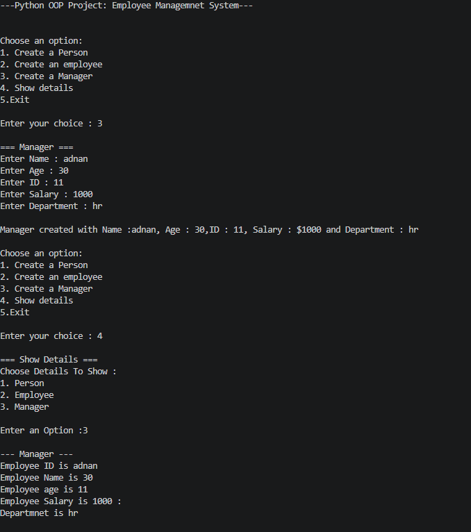

# Python OOP Project: Employee Management System

## Author

**Adnan Dal**

---

## 📌 Project Overview

The **Employee Management System** is a console-based Python project created to demonstrate the fundamental concepts of **Object-Oriented Programming (OOP)**.

The project allows users to create and display information about:

- Persons
- Employees
- Managers
- Developers

The project demonstrates how classes can be organized using inheritance and how different objects can have their own specific information and behavior.

---

## 🎯 Project Objectives

The main objectives of this project are:

- Understand the fundamentals of Object-Oriented Programming.
- Create and use classes and objects.
- Understand constructors.
- Demonstrate inheritance.
- Demonstrate encapsulation.
- Use private attributes.
- Understand getters and setters.
- Demonstrate method overriding.
- Understand the use of parent class functionality.
- Create a menu-driven console application.
- Accept and process user input.
- Display stored object information.

---

## 🛠️ Technologies Used

- **Programming Language:** Python
- **Programming Concept:** Object-Oriented Programming
- **Application Type:** Console / Terminal Application
- **External Libraries:** None

This project uses Python's built-in functionality and does not require any external packages.

---
## Features
- Classes

- Objects

- Constructors

- Encapsulation
 
- Private attributes
 
- Getters

- Setters

- Inheritance
 
- Method overriding

- Parent and child classes

- Menu-driven applications

- Loops

- Conditional statements

- User input

- Basic program structure
---

## 📂 Project Structure

The project consists of a Python program, output screenshot, and README documentation.

│
|
├── main.py
|
├── output.png
|
└── README.md

## Output 

